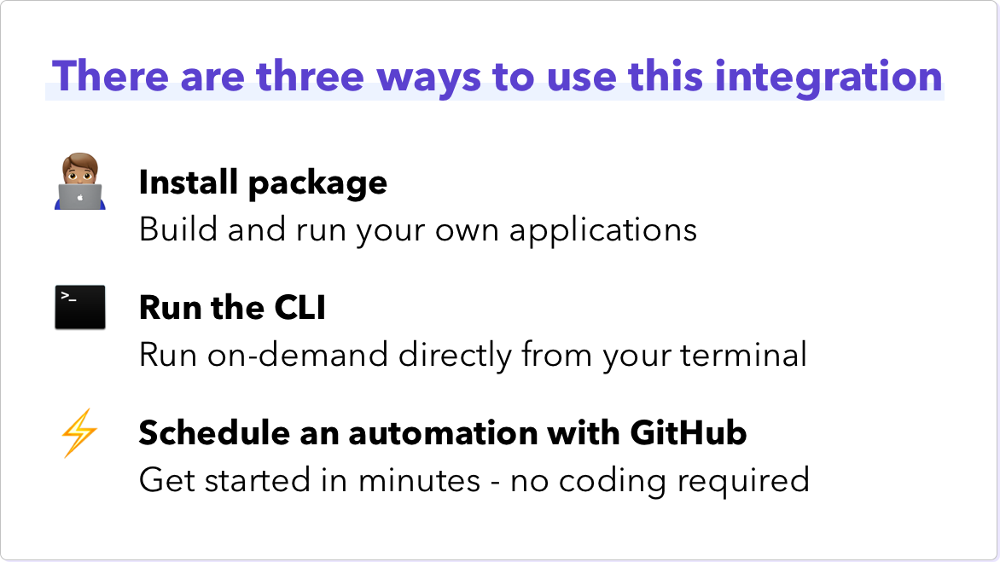

# Circle Interactions to Orbit Workspace


[](https://badge.fury.io/rb/circle_orbit)
[](.github/CODE_OF_CONDUCT.md)

Add your Circle interactions into your Orbit workspace with this community-built integration.


|<p align="left">:sparkles:</p> This is a *community project*. The Orbit team does its best to maintain it and keep it up to date with any recent API changes.<br/><br/>We welcome community contributions to make sure that it stays current. <p align="right">:sparkles:</p>|
|-----------------------------------------|



## First Time Setup

To set up this integration you will need your Circle API key and your Circle community URL. See the below table for instructions on where to find it, along with your Orbit API credentials.
## Application Credentials

The application requires the following environment variables:

| Variable | Description | More Info
|---|---|--|
| `CIRCLE_API_KEY` | Circle API key | Create a new API key in the API section in your User Settings
| `CIRCLE_URL`     | Circle community URL | This is your Circle custom URL, for example: `https://orbit.circle.so`
| `ORBIT_API_KEY` | API key for Orbit | Found in `Account Settings` in your Orbit workspace
| `ORBIT_WORKSPACE_ID` | ID for your Orbit workspace | Last part of the Orbit workspace URL, i.e. `https://app.orbit.love/my-workspace`, the ID is `my-workspace`

## Package Usage

Install the package with the following command

```
$ gem install circle_orbit
```

Then, run `bundle install` from your terminal.

You can instantiate a client by either passing in the required credentials during instantiation or by providing them in your `.env` file.

### Instantiation with credentials:

```ruby
client = CircleOrbit::Client.new(
    orbit_api_key: YOUR_API_KEY,
    orbit_workspace_id: YOUR_ORBIT_WORKSPACE_ID,
    circle_api_key: YOUR_CIRCLE_API_KEY
)
```

### Instantiation with credentials in dotenv file:

```ruby
client = CircleOrbit::Client.new
```
### Describe Method

Description:

```ruby
client.method
```
## CLI Usage

You can also use this package with the included CLI. To use the CLI pass in the required environment variables on the command line before invoking the CLI.

To check for ...:

```bash
$ ORBIT_API_KEY=... ORBIT_WORKSPACE_ID=... circle_api_key=... bundle exec circle_orbit --flag
```

## GitHub Actions Automation Setup

⚡ You can set up this integration in a matter of minutes using our GitHub Actions template. It will run regularly to add new activities to your Orbit workspace. All you need is a GitHub account.

[See our guide for setting up this automation](https://github.com/orbit-love/github-actions-templates/blob/main/Circle/README.md)

## Contributing

We 💜 contributions from everyone! Check out the [Contributing Guidelines](.github/CONTRIBUTING.md) for more information.

## License

This project is under the [MIT License](./LICENSE).

## Code of Conduct

This project uses the [Contributor Code of Conduct](.github/CODE_OF_CONDUCT.md). We ask everyone to please adhere by its guidelines.
